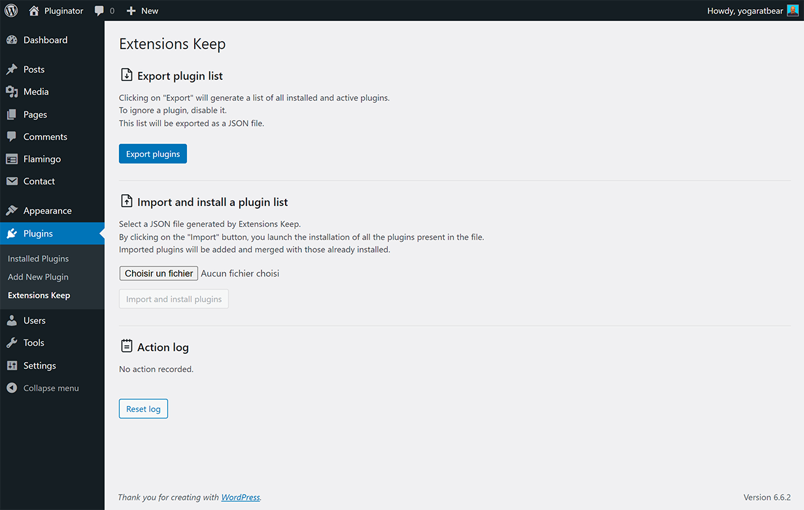
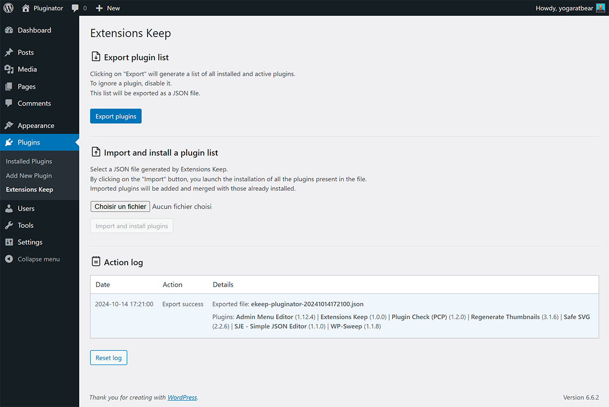
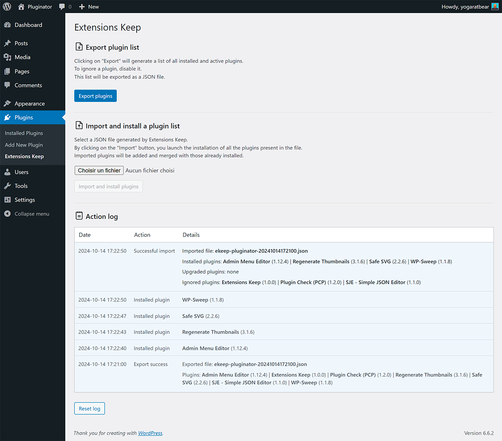

# Extensions Keep

Extensions Keep simplifies WordPress plugin management: export, install, and share with a single click.

## Description

Extensions Keep is a simple and practical tool for anyone who needs to efficiently manage their WordPress plugins across multiple sites.

### Key Features

- Quick export of your active plugins list
- Easy installation of plugins from an exported list
- Simplified sharing of plugin configurations between sites
- Secure backup of your plugin configurations
- Compatible with all WordPress plugins
- Intelligent management of plugin versions

## Installation

### Via WordPress

1. Search for "Extensions Keep" in the WordPress 'Add Plugin' menu.
2. Click "Install Now" then "Activate".

### Manual Installation

1. Download the plugin zip file.
2. In your WordPress dashboard, go to "Plugins" > "Add New".
3. Click on "Upload Plugin" at the top of the page.
4. Choose the Extensions Keep zip file and click "Install Now".
5. Once the installation is complete, click "Activate Plugin".

## Usage

After activation, access the tool via the "Plugins" > "Extensions Keep" menu in your WordPress dashboard.

## FAQ

**Q: Does Extensions Keep backup my plugin files?**
A: No, Extensions Keep only backs up the list of your active plugins and their versions. It does not backup the plugin files themselves.

**Q: Can I use Extensions Keep to transfer plugins between different sites?**
A: Yes, you can export the list of your plugins from one site and import it on another site to install the same plugins.

**Q: Does Extensions Keep automatically update my plugins?**
A: No, Extensions Keep does not manage plugin updates. It allows you to maintain a consistent list of plugins across different sites.

## Screenshots

Extensions Keep interface

Exporting the plugin list

Importing and installing plugins

## Changelog

### 1.0.0
- First public release
- Intuitive user interface for exporting and importing plugins
- Secure backup of plugin lists
- Functionality to install plugins from an imported list

## Contributing

Contributions are welcome! Feel free to open an issue or submit a pull request.

## License

This project is licensed under the GPL v3 or later. See the [LICENSE](https://www.gnu.org/licenses/gpl-3.0.html) file for details.

## Author

Created by [Paul Fleury](https://paulfleury.fr)